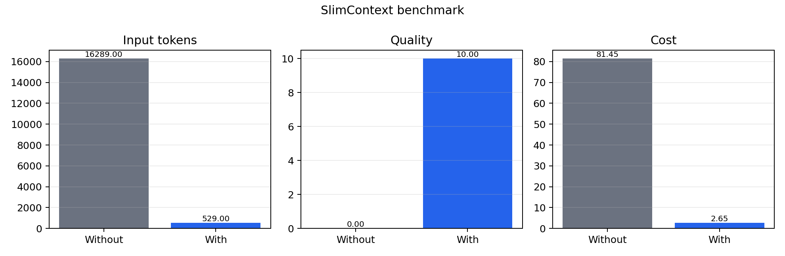

# SlimContext

Post-retrieval context optimizer: hash dedup -> embed -> cluster -> select -> MMR -> compress -> token budget.

## Tests

```powershell
python -m pip install -r requirements.txt
python -m pytest tests/ -q
```

Fast checks use fake embeddings, no model download.

| File | What it verifies |
|------|------------------|
| `test_dedupe.py` | exact duplicate removal + namespace isolation |
| `test_clustering.py` | similar vectors cluster together |
| `test_mmr.py` | MMR target_k + token budget skipping |
| `test_embeddings.py` | re-embed-all when any embedding missing |
| `test_api.py` | full HTTP endpoint with precomputed vectors |
| `test_benchmark_metrics.py` | benchmark dataset loading, token reduction, cost, and summary math |
| `test_benchmark_rag.py` | benchmark prompt construction smoke test |

## Run

Activate the environment:

```powershell
.\.venv\Scripts\Activate.ps1
```

Install packages:

```powershell
python -m pip install -r requirements.txt
```

Run the project:

```powershell
python -m app.scripts.demo_dedupe
```

Run the API:

```powershell
uvicorn app.api:app --reload
```

Optimize chunks:

```http
POST /v1/optimize
```

```json
{
  "chunks": [{ "id": "1", "text": "...", "embedding": null, "score": 0.91 }],
  "query": "How does JWT auth work?",
  "namespace": "hr-docs",
  "token_budget": 1500,
  "target_k": 8,
  "dedup_threshold": 0.15,
  "mmr_lambda": 0.5,
  "representative_strategy": "auto",
  "compress": true
}
```

SlimContext is a post-retrieval, pre-LLM layer. It accepts chunks from a vector database, BM25, hybrid search, tools, logs, or any other retriever, then returns cleaned, deduplicated, diversity-ranked chunks within a token budget. If chunks already include embeddings, the API reuses them and skips local embedding generation.

## RAG Benchmark

The benchmark compares two paths over the same Wikipedia-derived questions:

| Path | Context sent to the answer model |
|------|----------------------------------|
| Without SlimContext | All retrieved Wikipedia chunks |
| With SlimContext | Deduped, clustered, MMR-selected, compressed chunks within the token budget |

Generate a fixed JSONL dataset:

```powershell
python benchmarks/build_wikipedia_dataset.py --pages 20 --questions-per-page 3
```

Run the benchmark with local Ollama Qwen for both answers and DeepEval judging:

```powershell
ollama pull qwen2.5:7b
python benchmarks/benchmark_rag.py --dataset benchmarks/data/wikipedia_eval.jsonl --model qwen2.5:7b --judge-model qwen2.5:7b
```

Outputs are written to `benchmarks/results/`:

| File | Purpose |
|------|---------|
| `summary.json` | Full aggregate metrics and per-case results |
| `summary.csv` | README-friendly table data |
| `benchmark_chart.png` | Visual comparison of tokens, quality, and cost |

Latest benchmark table:

| Metric | Without SlimContext | With SlimContext |
|---|---:|---:|
| Avg input tokens | 11,016 | 589 |
| Token reduction | - | 94.65% |
| Answer quality (LLM judge 1-10) | 1.67 | 8.67 |
| Cost per 1M calls (Ollama Qwen token proxy) | $55.08 | $2.95 |
| Pipeline latency added | 0ms | measured in `summary.json` |

Run details: 3 Wikipedia cases, `qwen2.5-coder:7b` for answer generation and DeepEval `GEval` judging, `BAAI/bge-small-en-v1.5` embeddings, `target_k=8`, `token_budget=1500`.



The cost line is a configurable token-burn proxy, not an Ollama bill:

```text
avg_input_tokens * 1_000_000 / 1000 * $0.000005
```

Benchmark tips:

| Goal | How |
|------|-----|
| Keep test runs short | Add `--limit 3` to `benchmark_rag.py` |
| Avoid chart dependency during debugging | Add `--skip-chart` |
| Change SlimContext budget | Use `--token-budget 1500` |
| Change selected context count | Use `--target-k 8` |
| Use another local model | Change `--model` and `--judge-model` |

## Representative Selection

`auto` is the recommended default. It selects by `score` when any chunk in the cluster has a retrieval score greater than `0`, because RAG chunks usually arrive already ranked by vector search, hybrid search, or reranking. If no usable score is present, it falls back to `centroid`.

`score` selects the chunk with the highest retrieval score in each cluster. Use this as the default RAG behavior when chunks are already ranked by a vector database, hybrid search system, or reranker.

`centroid` selects the chunk closest to the average embedding of the cluster. Use this for generic chunks with no meaningful retrieval scores, such as logs, tool dumps, mixed-source content, or offline clustering jobs.

`query_closest` selects the chunk whose embedding is closest to the query embedding. Use this for Q&A flows where the best answer to the user query matters more than choosing the most typical chunk in the cluster.

`longest` selects the chunk with the most text. Use this when you want maximum information density, such as summarization preparation or context packing where longer chunks are preferred.

## Threshold Tuning

Clustering uses `dedup_threshold` as a cosine distance threshold. Start with `0.15` for prose and `0.10` for code, then expose the value to users so they can tune it for their corpus. Lower values make clustering stricter; higher values merge more chunks together.

## MMR Selection

MMR, or maximal marginal relevance, selects chunks with a greedy loop using `score = lambda * relevance - (1 - lambda) * diversity_penalty`. Relevance comes from `query_embedding` when provided; otherwise it uses normalized chunk `score`. The diversity penalty is the maximum cosine similarity between the candidate chunk and anything already selected.

`mmr_lambda` controls the relevance-diversity tradeoff. Values closer to `1.0` favor the most relevant or highest-scoring chunks, even if they are similar to each other. Values closer to `0.0` favor diversity and spread selections across different embedding areas. `0.5` is a balanced default.

MMR enforces chunk count with `target_k`. Token budget is enforced after MMR with `enforce_token_budget`: whole chunks are packed in order until the budget is full. Chunks that alone exceed the budget, or would push the total over, are skipped (`stats.budget_skipped_count`).

If any chunk is missing an embedding, SlimContext re-embeds **all** chunks from text with `embedding_model` (Distill-style), so every vector lives in the same space. If every chunk already has an embedding, client vectors are used as-is.

When `query` is provided, SlimContext embeds it once per request and uses that vector for MMR relevance. Pass `query_embedding` to skip query embedding when you already have it from your retriever.

## Project Structure

```text
app/
  api.py                 FastAPI app and /v1/optimize endpoint
  core/
    clustering.py        Agglomerative clustering and representative selection
    compression.py       Lightweight prune and structured placeholder compression
    dedupe.py            Exact hash dedupe and MinHash near-duplicate helpers
    mmr.py               MMR ranking and token-budget packing
  data/
    chunks.py            Sample policy chunks for local testing
  scripts/
    demo_dedupe.py       Local dedupe demo
    embedding_generator.py
benchmarks/
  build_wikipedia_dataset.py
  benchmark_rag.py
  metrics.py
```
